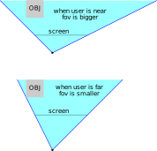

# Roadmap
一些目前想到要完成的功能，分成目前 Prototype 有的功能 與 TODO。

## 目前 Prototype 有的功能

### 可以刪掉
這是之前沒有 vibe coding 好的功能，有加上去卻沒有顯示，而且應該沒有實際用途，建議刪掉
- z roll：根據人眼斜率旋轉 => 事實是不應該轉
- 旋轉球體動畫：可能是因為目前沒有寫好著色器之類的，看不出旋轉

### 推定使用者頭部 3D 座標
- 人臉太陽穴近大遠小 + webcam 圖片二維座標
- 由此在 sensitivity 範圍內調整相機座標

### 跟隨頭部位置修改檢視
- 移動有平滑化處理
- 檢視模式變換：
  - 模式 1：螢幕模仿視窗
    - 無線遠處消失點隨使用者的頭 x & y 向移動，左右上下移動
    - 頭靠近就放大、遠離就縮小
    - 好像叫不對稱投影 (Off-axis Projection / Frustum Shift)
  - 模式 2：環繞目標模型（視覺收斂）
  - TODO：改成 on/off 而非現在的 slider

### xz 網格與 xy 網格
- 有益於營造空間感 + debug

### 顯示準心
- 目前會把準心印在 xy 網格上，是「無限遠處的視覺收斂點」到「相機」之間連線，在該面上的交點
- 還會把這條線投影在 xy & xz 網格上
- 以上東西有益於 debug

### 螢幕點兩下，可以全螢幕
如題，方便檢視

## TODO
### 校準使用者螢幕指南
需要知道物理顯示器的大小，以調整 Sensitivity X, Y, Z，使得「模式 1：螢幕模仿視窗」下，當使用者頭正對螢幕最左上時，準心也在螢幕左上角。

另外，還可能要有 Offset X, Y, Z（尤其 Y）。不然使用者可能會發現人臉正對螢幕中間時，準心在螢幕下面。

### Load File
允許使用者上傳 3D 模型檔案（例如 `.obj`, `.gltf` 等），並在場景中顯示。
- 支援拖曳上傳或點擊選擇檔案 (Guest mode)。
- 顯示公開模型（從 gallery 來的使用者；依照 id 讀取 model）

### `class Panel`
用於記錄與提供 UI 調整以下設定，並把更改後的設定存 localStorage（不存 SQL 因為一個使用者可能有多裝置）
  - Sensitivity X, Y, Z（見 校準使用者螢幕指南）
  - Offset X, Y, Z
  - 模式切換
  - 是否顯示準心

### z 軸重調整
（可能涉及重寫投影公式）
當我們頭靠近窗戶時，能看到原本在視線死角的地方。這相當於 view cone 的角度增加，而遠方的東西應該要變更小。但現在的邏輯卻是相機向前移動，這種模擬不真實而需要改進（詳見下圖）

可以考慮要不要作為第三個檢視模式，或者直接修改模式 1。

### 與物件互動
如果我們想跟螢幕上的物體互動（有什麼互動能做？選擇然後修改姿態 & 位置嗎？），我們需要找到視線上最近的物體。
「模式 1：螢幕模仿視窗」下，可能可以重用現在畫準心的代碼。

### 虛擬眼睛移動
幾種可能性。可以擇幾個做，也可以全做。

1. w a s d arrowUp arrowDown
    這是常見的前後左右移動 + 抬頭低頭
2. space to hold the screen（我想做這個）
    按住空白鍵以固定相機位置，鬆手以重新使用人頭座標。相當於 cam pos += 按下後人頭位置 - 按下前人頭位置
3. 滑鼠拖拽以移動？

